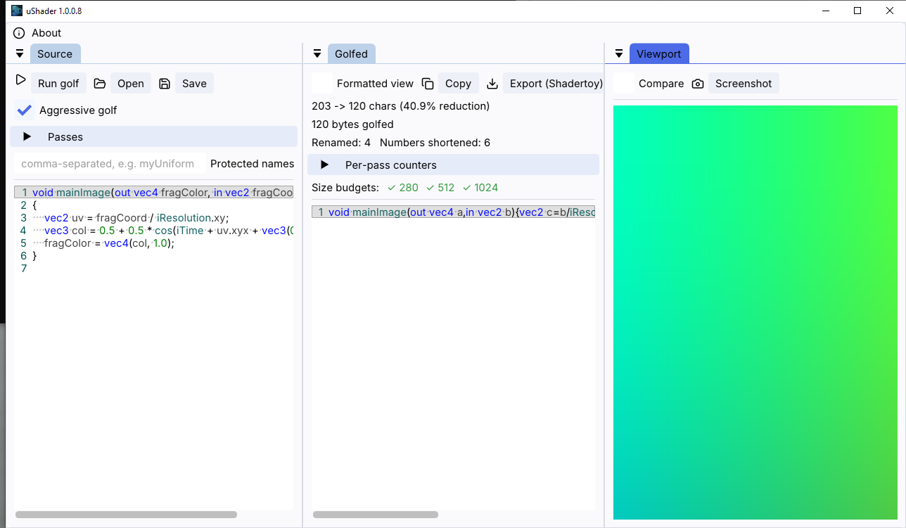

# µShader

Native Windows 10/11 GLSL shader golfer — minify a Shadertoy-style
`mainImage` fragment shader and preview the result live.

µShader pairs a tokenizer-based Rust minification engine with a
native SDL3 + OpenGL + Dear ImGui application shell: paste a shader,
golf it, and immediately verify it renders identically in the live
viewport. The UI is a dark, Adobe Premiere Pro–style editing
workspace with a custom borderless window frame.



## Features

- **Golfing engine**: identifier renaming, numeric literal shortening,
  and whitespace stripping always run; an aggressive mode adds 16
  further transformation passes (dead-code elimination, constant
  folding, declaration merging, function inlining, algebraic identity
  simplification, common subexpression elimination, and more), each
  individually toggleable, plus a protected-names list for identifiers
  that must never be renamed. Every pass is designed to never change
  shader behavior — each ships with its own regression fixture and
  Rust unit tests.
- **Live viewport** with the standard Shadertoy uniform set (`iTime`,
  `iResolution`, `iMouse`, `iDate`, `iFrame`, `iFrameRate`), and a
  Compare mode that renders the source and golfed shaders side by
  side to confirm golfing didn't change the output.
- **GLSL-aware text editor** (syntax highlighting, error-line
  highlighting on compile failure) for both the Source and Golfed
  panels, with a "Formatted view" toggle for reading the golfed
  one-liner across multiple lines.
- **Reduction stats**: char/byte counts, reduction percentage,
  per-pass counters, and size-budget badges (280/512/1024 bytes).
- **Import/export**: open and save `.glsl` files, copy the golfed
  output to the clipboard, export in Shadertoy format, and capture
  the viewport to a PNG screenshot.
- **Golfing profiles**: save the current pass toggles, protected-names
  list, and budget preset to a `.ushaderprofile` file, and load one
  back later, via "Save profile…" / "Load profile…" in the golf
  controls panel. Three built-in read-only profiles (`Maximum`,
  `Safe`, `None`) are also available from the same "Profile" combo,
  and the last profile path used is remembered across restarts.
- **Pass-by-pass trace**: a "Trace" tab lists every golfing pass
  considered on the last run, with its change count; expanding a pass
  shows a side-by-side before/after view of that one pass's own delta,
  syntax-highlighted the same way as the Source and Golfed editors.
  Passes that made no change stay listed, grayed out, so the trace is
  a complete record rather than only the passes that fired.
- **Diff panel**: tabbed alongside Trace, an inline unified diff shows
  exactly what changed between Source and Golfed as a whole, with
  removed text struck through in red and added text in green.
- **Viewport recording**: capture the running shader to an animated
  GIF, or to MP4/WebM via a bundled `ffmpeg.exe` — no separate
  install required.
- **Multi-document workspace**: work on several shaders at once from a
  tab strip above the dock, one tab per open `.glsl` file. Each tab
  keeps its own editor buffer, golf result, pass toggles,
  protected-names list and budget preset, and switching tabs never
  re-runs the golf engine on the tab you left. A `+` button and a
  `File` menu (`New tab`, `Open`, `Save`, `Save as…`, `Close tab`)
  manage the open set; a dot on a tab marks unsaved changes, and
  closing a dirty tab or exiting with unsaved shaders asks before
  discarding.
- **Session persistence**: on exit the open files, active tab, per-tab
  pass/profile state and panel layout are saved to
  `%APPDATA%\ushader\last_session.ushaderworkspace`. On the next launch
  a "Restore last session?" prompt offers to reopen exactly where you
  left off — files are never reopened without your confirmation.
- **Command palette** (`Ctrl+Shift+P`): a fuzzy-searchable list of
  every action in the app — run golf, toggle any pass, load/save a
  profile, switch tabs, toggle Compare mode, export, and more.
- **Rebindable keyboard shortcuts**: the command palette, new tab,
  open, save, and close-tab shortcuts can be rebound from the
  "Keyboard Shortcuts" tab next to "About", persisted to
  `%APPDATA%\ushader\keybindings.json`.
- **Minimap**: an optional compact colored overview of the Source and
  Golfed editors, syntax-colored the same way as the editors
  themselves, for jumping around longer shaders.
- **Local session reports**: "Export report…" (File menu or command
  palette) writes a single self-contained HTML file — source and
  golfed code (syntax-highlighted), size/budget badges, per-pass
  counters, and the equivalence-check result, with everything inlined
  and no external references, so it opens correctly offline. An
  "Include screenshot in report" checkbox (off by default) embeds the
  current viewport as a base64 image.
- **Drag-and-drop & Recent Files**: drop one or more `.glsl` files
  onto the main window to open each as a new tab. A "Recent Files"
  submenu under `File` lists previously opened/saved shaders (from
  the dialog, drag-and-drop, or a prior Recent Files entry),
  persisted to `%APPDATA%\ushader\recent_files.json`; entries pointing
  at files that no longer exist are pruned automatically.

## Batch pipeline (CLI)

Alongside the GUI, `rust-core` builds a `golf` command-line tool for
embedding µShader in an offline asset pipeline. Given a single file (or
stdin) it prints the golfed shader to stdout; given a directory or a
glob it golfs every `.glsl` file found — using the exact same engine
entry point as the GUI, so the two can never diverge — and writes each
result next to its input as `<name>.min.glsl`.

```bash
cargo build --release --manifest-path rust-core/Cargo.toml --bin golf

golf shader.glsl > shader.min.glsl
golf -a "shaders/**/*.glsl"
golf --profile studio.ushaderprofile --budget "4KB intro" \
     --report sizes.json shaders/
golf --diff shader.glsl
```

Key flags: `--profile` loads a `.ushaderprofile` saved from the GUI,
`--budget <preset>` exits non-zero when any file exceeds the size
threshold (for failing a CI build on regression), `--report
<path.json|path.csv>` writes a machine-readable per-file report,
`--diff` prints a unified source/golfed diff for a dry-run, and
`--pretty` opts into colored output (off by default so CI logs stay
clean). Run `golf --help` for the full list.

## Installing

Download the latest `uShader-Setup-*.exe` from the
[Releases](https://github.com/Patrickjaillet/MicroShader/releases)
page and run it. The installer is not code-signed, so Windows
SmartScreen may show an "unknown publisher" warning on first run —
click "More info" -> "Run anyway" to proceed.

Requires Windows 10 or 11 (64-bit). Verified on Windows 10 (LTSC 2019,
build 17763); not yet independently verified on Windows 11.

## Building from source

Requirements:

- Windows 10 or 11
- Visual Studio 2022 Build Tools (MSVC, C++20)
- CMake ≥ 3.21
- Rust toolchain with the `x86_64-pc-windows-msvc` target

```bash
cmake -S . -B build
cmake --build build
```
```bash (Release) 
cmake -S . -B build -D CMAKE_BUILD_TYPE=Release
cmake --build build --config Release
```

To build the installer, install [Inno Setup 6](https://jrsoftware.org/isinfo.php)
and run:

```bash
& "C:\Program Files (x86)\Inno Setup 6\ISCC.exe" /DMyAppVersion=1.0.0.0 installer\ushader.iss
```

## License

[MIT](LICENSE) — free to reuse, modify, and redistribute. Bundles a
GPL-licensed `ffmpeg.exe` for MP4/WebM recording as a standalone
executable invoked as a subprocess; see
[THIRD_PARTY_NOTICES.md](THIRD_PARTY_NOTICES.md).

## About

**µShader**
Copyright © 2026 SANDEFJORD DEVELOPMENT (Patrick JAILLET) — All rights reserved
Email: contact.shaderstudio@gmail.com
Website: https://github.com/Patrickjaillet
Repository: https://github.com/Patrickjaillet/MicroShader
