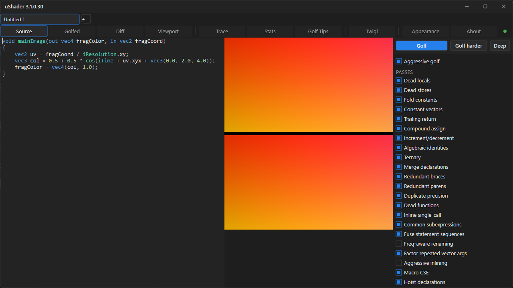

# µShader

µShader is a Windows 10/11 application that **golfs** (minifies) a
Shadertoy-style GLSL fragment shader (`mainImage`) and shows you the
result running live, side by side with the original, so you can
confirm the shrunk version still looks exactly the same.

## Contents

- [Installing](#installing)
- [Starting the app](#starting-the-app)
- [The window layout](#the-window-layout)
- [Writing or opening a shader](#writing-or-opening-a-shader)
- [Golfing your shader](#golfing-your-shader)
- [Reading the result](#reading-the-result)
  - [Golfed tab](#golfed-tab)
  - [Diff tab](#diff-tab)
  - [Trace tab](#trace-tab)
  - [Stats tab](#stats-tab)
  - [Golf Tips tab](#golf-tips-tab)
- [Checking the result: Compare mode](#checking-the-result-compare-mode)
- [Size budgets](#size-budgets)
- [Golfing profiles](#golfing-profiles)
- [Exporting your shader](#exporting-your-shader)
  - [Copying/saving the golfed code](#copyingsaving-the-golfed-code)
  - [Exporting to twigl.app](#exporting-to-twiglapp)
  - [Session report](#session-report)
  - [Capturing a screenshot or GIF](#capturing-a-screenshot-or-gif)
- [Command palette](#command-palette)
- [Keyboard shortcuts](#keyboard-shortcuts)
- [Recent files and session restore](#recent-files-and-session-restore)
- [Appearance and accessibility](#appearance-and-accessibility)
- [License](#license)
- [About](#about)

## Installing

Download the latest `uShader-Setup-*.exe` from the
[Releases](https://github.com/Patrickjaillet/MicroShader/releases)
page and run it.

The installer is not code-signed, so Windows SmartScreen may show an
"unknown publisher" warning on first run — click **More info** then
**Run anyway** to continue.

Requires Windows 10 or 11 (64-bit). No separate runtime needs to be
installed; µShader is a single self-contained application.

## Starting the app

Launch **uShader** from the Start menu (or the desktop shortcut if you
created one during installation). The app opens maximized, showing a
default sample shader already loaded and running.

## The window layout

µShader has a custom, borderless dark window with its own title bar
(minimize / maximize / close in the top-right corner, exactly like a
normal Windows window).

Below the title bar sits a strip of open documents (one tab per
shader you have open — see [Recent files and session
restore](#recent-files-and-session-restore)), and below that the main
tab strip, grouped into four sections:

- **Author** — Source, Golfed, Diff, Viewport
- **Analyze** — Trace, Stats, Golf Tips
- **Export** — Twigl
- **Settings** — Appearance, About

On every tab except Viewport, a panel on the right edge of the window
holds the golfing controls (see [Golfing your
shader](#golfing-your-shader)), and a column of three small, labeled,
always-live previews — **Source**, **Golfed**, and **Twigl** — sits
just to its left, so you can visually confirm all three still render
the same image no matter which tab you're on. The Twigl preview stays
blank (its label changes to say so explicitly) whenever the current
Twigl Export settings (ES 3.00 or MRT) produce a shader this desktop
viewport can't run — that's a known WebGL2-only limitation of those
two options, not a bug.

## Writing or opening a shader

The **Source** tab is a text editor with GLSL syntax highlighting
where you write or paste your shader's `mainImage` function.

To load a shader from disk:

- **Ctrl+O** (or the command palette) opens the standard Windows file
  picker, filtered to `.glsl` files.
- **Drag and drop** a `.glsl` file straight onto the µShader window.
- Pick an entry from **Recent Files** in the command palette.

To save your current source code, press **Ctrl+S** (or **Ctrl+Shift+S**
for Save As). A dot appears on a document's tab whenever it has
unsaved changes; closing a tab or the app with unsaved changes asks
for confirmation first.

If the shader fails to compile, the offending line is highlighted
directly in the Source editor and the title-bar status indicator turns
red; a successful compile shows a brief green pulse.

## Golfing your shader

Press **F5**, click the **Golf** button at the top of the right-hand
panel, or use the command palette's **Run golf** entry to shrink the
current source code. The result appears in the **Golfed** tab.

The right-hand panel lets you control exactly how aggressive the
golfing is:

- **Aggressive golf** — a master switch. Turned off, only the always-on
  basics run (renaming identifiers, shortening numbers, stripping
  whitespace). Turned on, a long list of additional, individually
  toggleable transformations becomes available: removing dead code,
  simplifying calculations, merging declarations, and many more.
- **Protected names** — a comma-separated list of identifiers (for
  example uniform names your own tooling depends on) that must never
  be renamed, no matter what.
- **Golf harder** — a secondary button that automatically searches for
  an even smaller combination of the available options than what's
  currently selected. If it finds a smaller result, it doesn't replace
  your golfed output silently — it stages the result on the **Diff**
  tab with an **Apply harder result** button, so you can review the
  change before accepting it. A **Deep search** option next to it
  spends more time looking for a better result.

## Reading the result

### Golfed tab

Shows the minified, read-only result. Toggle **Formatted view**
(`Ctrl+Shift+F`, or the button in the top-right of the tab) to
re-indent the one-liner across multiple lines for easier reading —
this is purely a display option, the code that actually gets copied
or exported is always the compact version.

### Diff tab

Shows a unified, color-coded difference between the Source and Golfed
tabs: removed text struck through in red, added text in green — a
quick way to sanity-check exactly what golfing changed.

### Trace tab

Lists every golfing pass that was considered on the last run, along
with how many changes it made. Click a pass to expand it and see a
side-by-side before/after view of just that pass's own effect. Passes
that made no changes are still listed, grayed out, so this tab is
always a complete record of what happened.

### Stats tab

Shows character/byte counts before and after golfing, the reduction
percentage, a breakdown per pass, and color-coded badges against your
chosen size budget (see [Size budgets](#size-budgets)). A "Golf power"
section summarizes the overall gain and which passes actually fired.

### Golf Tips tab

A searchable catalogue of manual golfing techniques you can apply by
hand: compact rotation-matrix constants, common trigonometric
identities, short noise/hash generators, 3D distance-field shape
primitives, color-palette generators, and gamma/tonemap one-liners.
Every entry can be copied to the clipboard, or inserted directly at
your cursor in the Source editor, with one click — nothing is ever
inserted automatically. If your golfed output goes over its size
budget, a banner on the Trace tab links straight here.

## Checking the result: Compare mode

Switch to the **Viewport** tab and press **Ctrl+Shift+C** (or use the
command palette) to enable **Compare mode**: the window splits in two,
rendering the Source shader on the left and the Golfed shader on the
right, so you can visually confirm golfing didn't change how the
shader actually looks.

## Size budgets

Competitive shader golfing and demoscene productions are usually
judged by file size after compression, not raw character count. The
Stats panel lets you pick a **budget preset** — Shadertoy, an X/Twitter
shader, JS13K-style 13KB, or a 4KB/8KB/64KB intro — and shows a
raw-byte and/or compressed-byte badge, colored green, amber, or red
depending on how close you are to that limit.

## Golfing profiles

Rather than re-checking every pass by hand each time, you can save
your current settings (every pass toggle, the protected-names list,
and the chosen size budget) to a `.ushaderprofile` file via **Save
profile...**, and reload them later with **Load profile...**. Three
built-in profiles are always available: **Maximum** (everything on),
**Safe** (conservative, dead-code removal only), and **None**
(aggressive golfing off).

The **Import exclude list...** action reads a plain-text, Shader
Minifier–style list of names (one per line) and merges them into your
protected-names field.

## Exporting your shader

### Copying/saving the golfed code

The command palette offers one-click copies of the golfed code, ready
to paste into other tools:

- **Copy as Shadertoy** / **Copy as Bonzomatic** — the golfed code
  as-is (both platforms supply the standard uniforms themselves).
- **Copy as bare main()** — rewrites the shader into a standalone
  fragment shader with its own uniform declarations and a plain
  `void main()`, for GLSL sandboxes that don't understand the
  Shadertoy API on their own.

### Exporting to twigl.app

The **Twigl** tab (`Ctrl+Alt+T`) converts your golfed shader into the
format expected by [twigl.app](https://twigl.app), a popular shader
one-liner playground:

- Pick a mode along twigl's ladder — **Classic**, **Geek**, **Geeker**,
  or **Geekest** (each one shortens the uniform names and boilerplate
  further).
- Toggle **ES 3.00** if you want a WebGL2-flavored export.
- Toggle **MRT** (multiple render targets), **Backbuffer**, and
  **Sound** to match the twigl.app features your shader actually uses.
- A live preview and a byte-budget gauge (twigl's 280-character tweet
  limit in Geekest mode) update as you change these options.
- **Copy for twigl.app** puts the result on the clipboard, with a
  brief on-screen confirmation once it's done.
- **Import twigl shader** does the reverse: click into the preview box,
  paste code copied from twigl.app (or type it by hand in twigl's
  shorthand) — it stays there even if you switch tabs or edit the
  Source tab in the meantime — then click this button to convert it
  back into a normal, editable shader in the Source tab. Make sure the
  mode button matches what the pasted code actually uses first (e.g.
  select **Geek** before pasting Geek-shorthand code); ES 3.00 and MRT
  toggles are read from the pasted code itself, so those don't need to
  be pre-selected.

### Session report

**Export report...** (File menu or command palette) writes a single,
self-contained HTML file — no internet connection needed to open it —
containing your source and golfed code, the size/budget summary, and
the per-pass statistics. A checkbox lets you optionally embed a
screenshot of the current viewport in the report.

### Capturing a screenshot or GIF

The command palette's **Screenshot** action saves the current viewport
frame as a PNG file. **Capture GIF** records a short, looping animated
GIF of the live viewport at one of three built-in size/duration
presets.

## Command palette

Press **Ctrl+Shift+P** to open the command palette: a fuzzy-searchable
list of every action in the app — running golf, switching tabs,
toggling Formatted or Compare view, opening/saving, recent files,
export shortcuts, and more. Type to filter, use the arrow keys and
Enter to run an entry, or click one with the mouse.

## Keyboard shortcuts

| Shortcut | Action |
|---|---|
| `F5` | Run golf |
| `Ctrl+N` | New document |
| `Ctrl+O` | Open a shader |
| `Ctrl+S` | Save |
| `Ctrl+Shift+S` | Save As |
| `Ctrl+W` | Close the current document |
| `Ctrl+Shift+P` | Command palette |
| `Ctrl+Shift+F` | Toggle Formatted view |
| `Ctrl+Shift+C` | Toggle Compare mode |
| `Ctrl+Alt+T` | Twigl Export tab |

These are stored in `%APPDATA%\ushader\keybindings.json`; a malformed
or missing file automatically falls back to the defaults above, so the
app is never left without shortcuts.

## Recent files and session restore

Every file you open or save is added to a **Recent Files** list in the
command palette; entries pointing at a file that no longer exists are
removed automatically.

On exit, the whole session — every open document, whether saved to
disk or not — is remembered and offered back to you the next time you
launch the app, so you can pick up exactly where you left off.

## Appearance and accessibility

The **Appearance** tab lets you adjust:

- **UI text size**, from 13 to 28 pt.
- **Colorblind-safe status indicators** — shape-differentiated status
  dots (circle/triangle/square) instead of relying on color alone.

Most interactive controls (buttons, tabs, checkboxes, sliders) in µShader
are exposed to Windows screen readers (such as Narrator) with a proper
name, role, and live state. Coverage is not yet complete for Diff, Trace,
Stats, Keybindings, Command Palette and Minimap panels.

## License

[MIT](LICENSE) — free to reuse, modify, and redistribute. Bundles no
third-party binaries; see
[THIRD_PARTY_NOTICES.md](THIRD_PARTY_NOTICES.md).

## About

**µShader**
Copyright © 2026 SANDEFJORD DEVELOPMENT (Patrick JAILLET) — All rights reserved
Email: sandefjord.development@proton.me
Website: https://github.com/Patrickjaillet
Repository: https://github.com/Patrickjaillet/MicroShader
